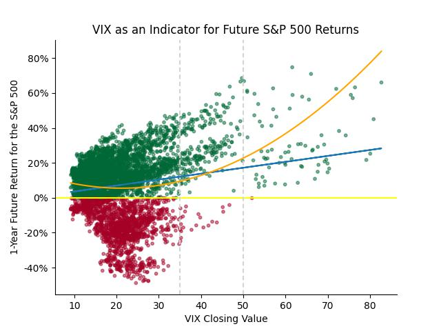

# STOCK MARKET PREDICTOR: Using the Vix to Predict S&P 500 Future Returns

The website for this information can be found at [stock-forecaster.herokuapp.com](https://stock-forecaster.herokuapp.com/).

## Summary

The Vix is the popular name for the Chicago Board Options Exchange's Volatility Index, a measure of the stock market's expected volatility based on S&P 500 index options. It is often referred to as the fear index or fear gauge. The Vix signals the level of fear or stress in the stock market. The higher the VIX, the greater the level of fear and uncertainty in the market, with levels above 30 indicating high levels of uncertainty.

The S&P 500 is the Standard and Poor's 500 index - a stock market index tracking the stock performance of 500 of the largest companies listed on stock exchanges in the United States. It is one of the most commonly followed equity indices, and is the index frequently referred to as "the market".

Machine learning models here demonstrate how elevated levels of the Vix can help predict a positive gain for the S&P 500 index one year into the future. When the Vix rises above 35, and especially above 50, this chart illustrates the historical return on the S&P 500 over the following year.

The performance of the S&P 500 is charted here from 2000-2023.

For each day, the one-year future return of the S&P 500 is plotted, with the percentage return on left (y-axis). The bottom (x-axis) shows the corresponding Vix value one-year prior. When the Vix is above 35, the S&P 500 has yielded positive returns 92.5% of the time over the following year. When the Vix exceeds 50, 98.6% of the returns were positive.

## Data

Real-time API data on the website is collected from the [yfinance API](https://algotrading101.com/learn/yfinance-guide/). API data that used in building the machine learning models obtained from the the [yahoo-fin API](https://theautomatic.net/yahoo_fin-documentation/). All API data is originally sourced from [yahoo! Finance](https://finance.yahoo.com/).

21 ticker symbols were evaluated as inputs:
☆ S&P 500 (^GSPC)
☆ Dow Jones Industrial Average (^DJI)
☆ NASDAQ Composite (^IXIC)
☆ Russell 2000 (^RUT)
☆ S&P Consumer Staples Sector (XLP)
☆ S&P Energy Sector (XLE)
☆ S&P Financial Sector (XLF)
☆ S&P Health Care Sector (XLV)
☆ S&P Industrial Sector (XLI)
☆ S&P Materials Sector (XLB)
☆ S&P Real Estate Sector (XLRE)
☆ S&P Technology Sector (XLK)
☆ S&P Utilities Sector (XLU)
☆ S&P Communication Services (XLC)
☆ S&P Consumer Discretionary (XLY)
☆ CBOE Volatility Index (^VIX)
☆ CBOE 3-Month Volatility (^VIX3M)
☆ Crude Oil Futures (CL=F)
☆ Treasury Yield 10 Years (^TNX)
☆ Bitcoin USD (BTC-USD)
☆ CMC Crypto 200 Index (^CMC200)

The results were measured for two securities:
☆ SPY (an ETF that mirrors the S&P 500)
☆ USO (an ETN made up of oil futures)

## Process

### Model 1:  
### Looping a Neural Network Model

The first model was a neural network run in Google Colaboratory. A list of 21 market ticker symbols were read into the code, and a loop determined each unique pair. For each pair, there were two different securities that were tested against for successful results. This created groups of three ticker symbols, and a total of 420 unique combinations to test with each model run.

Each combination of three securities was then processed and tested via an automated inner loop wrapped in an outer loop. 'yahoo! Finance' data for each was retrieved and loaded into pandas dataframes via the yahoo-fin API. The data was cleaned and merged into a single dataframe. The data was then scaled with StandardScaler, trained, compiled, and fit into a ReLU neural network model with 2 hidden layers, 5 nodes, and 5 epochs.

Results were reported for each of the 420 combinations. After completion, the input features and other variables (such as the length of time the results were testing) were adjusted, and the process was run to loop through and test the 420 combinations again with the adjustments. This entire process was repeated numerous times, and results were recorded. Any accuracy results over 70% for these first rounds of testing were noted.

At this point, it became clear that combinations containing the 'VIX' and 'VIX3M' closing values were generally returning the highest results. The outcomes were testing for a Boolean 'yes/no' positive result. They were highest when joined with the S&P 500 results, and a timeframe of one year was especially promising. Therefore, testing the S&P 500 results with the VIX and VIX3M closing values became the inputs for the next step, Model 2.