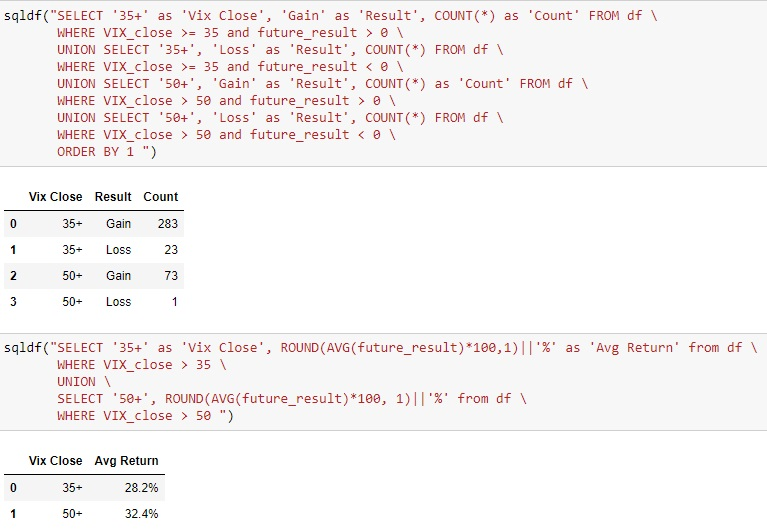

# STOCK MARKET PREDICTOR:   Using the Volatility Index to Predict S&P 500 Returns

This website is hosted at [stock-forecaster.herokuapp.com](https://stock-forecaster.herokuapp.com/).

Past performance may not be indicative of future results. The information on this site is provided for discussion purposes and should <b>not</b> be considered as investment advice. There is no assurance that the future performance of any investment, strategy, or product made reference to directly or indirectly here will be profitable, equal any historical performance levels, or be suitable for your portfolio.

## Summary

The Vix is the popular name for the Chicago Board Options Exchange's Volatility Index, a measure of the stock market's expected volatility based on S&P 500 index options. It is often referred to as the fear index or fear gauge. The Vix signals the level of fear or stress in the stock market. The higher the VIX, the greater the level of fear and uncertainty in the market, with levels above 30 indicating high levels of uncertainty.

The S&P 500 is the Standard and Poor's 500 index - a stock market index tracking the stock performance of 500 of the largest companies listed on stock exchanges in the United States. It is one of the most commonly followed equity indices, and is the index frequently referred to as "the market".

Three machine learning models used together have uncovered and demonstrated an interesting use for the Vix: elevated levels of the Vix can be used as a possible predictor of a positive result for the S&P 500 index one year into the future. When the Vix rises above 35, and especially above 50, the historical return on the S&P 500 is typically up strongly from that point over the following year.

The process and results are also presented at [stock-forecaster.herokuapp.com](https://stock-forecaster.herokuapp.com/).

The performance of the S&P 500 is charted here from 2000-2023.

Each plotted point represents one day. The one-year gain/loss of the S&P 500 is on left (y-axis). The bottom (x-axis) shows the corresponding Vix value one-year prior. When the Vix rises above 35, the S&P 500 has yielded positive returns 92.5% of the time (283 out of 309) over the following year. When the Vix exceeds 50, the sample size is smaller but 98.6% of the returns (73 of 74) were positive.

## Modules

3 machine learning modules were built and run in succession:
* Model1_Stock_multi_loop_Neural_Net_Mach_Learn.ipynb
* Model2_Stock_single_pair_multi_test_Neural_Net_Mach_Learn.ipynb
* Model3_Stock_VIX_SP500.ipynb

'model.pkl' was exported from Model3_Stock_VIX_SP500.ipynb and embedded at [stock-forecaster.herokuapp.com](https://stock-forecaster.herokuapp.com/).

Flask application 'app.py' contains 3 routes:
* / (home) renders index.html, for the initial load
* predict also renders index.html, but modified for returning user entered modelling results
* models renders models.html, for a more detailed description of processes

templates/index.html for the main web page
templates/models.html for additional information on the machine learning models
static/css/styles.css for style formating
static/images for displayed images

data folder for two .xlsx files exported from 'Model1_Stock_multi_loop_Neural_Net_Mach_Learn.ipynb'

'Procfile', 'requirements.txt', and the stock-forecaster folder for Heroku deployment

## Data

Real-time API data on the website is collected from the [yfinance API](https://algotrading101.com/learn/yfinance-guide/). API data that used in building the machine learning models obtained from the the [yahoo-fin API](https://theautomatic.net/yahoo_fin-documentation/). All API data is originally sourced from [yahoo! Finance](https://finance.yahoo.com/).

Three models were used, with the first model automating a three-input loop which cycled through every unique pair of 21 securities, and then grouped each pair with the future results of two other securities (the S&P 500 and oil futures). Each run therefore consisted of 420 groupings, after which the other parameters (features used as model inputs, number of days used to determine the future return, etc.) were adjusted, and then the process was repeated.

21 ticker symbols were evaluated as inputs:  
* S&P 500 (^GSPC)  
* Dow Jones Industrial Average (^DJI)  
* NASDAQ Composite (^IXIC)  
* Russell 2000 (^RUT)  
* S&P Consumer Staples Sector (XLP)  
* S&P Energy Sector (XLE)  
* S&P Financial Sector (XLF)  
* S&P Health Care Sector (XLV)  
* S&P Industrial Sector (XLI)  
* S&P Materials Sector (XLB)  
* S&P Real Estate Sector (XLRE)  
* S&P Technology Sector (XLK)  
* S&P Utilities Sector (XLU)  
* S&P Communication Services (XLC)  
* S&P Consumer Discretionary (XLY)  
* CBOE Volatility Index (^VIX)  
* CBOE 3-Month Volatility (^VIX3M)  
* Crude Oil Futures (CL=F)  
* Treasury Yield 10 Years (^TNX)  
* Bitcoin USD (BTC-USD)  
* CMC Crypto 200 Index (^CMC200)

The results were measured for two securities:  
* SPY (an ETF that mirrors the S&P 500)  
* USO (an ETN made up of oil futures)

## Process

### Model 1: Looping a Neural Network to Find the Best Candidates

The first model consisted of a neural network run in Google Colaboratory. A list of 21 market ticker symbols were read into the code, and a loop determined each unique pair. That resulted in 210 unique pairs. For each pair, there were two different outut securities that were tested against for successful results. This resulted in 420 unique combinations to test with each run of the model.

Each combination of three securities was then processed and tested via an automated inner loop with an outer loop. 'yahoo! Finance' data for each was retrieved and loaded into pandas dataframes via the yahoo-fin API. The data was cleaned and merged into a single dataframe. The data was then scaled with StandardScaler, trained, compiled, and fit into a ReLU neural network model with 2 hidden layers, 5 nodes, and 5 epochs.

Results were recorded for the 420 combinations, the input features and other variables were adjusted, and the model was run again. This process was repeated numerous times, and accuracy results over 70% for these initial rounds of testing were noted.

Combinations containing the 'VIX' and 'VIX3M' closing values were generally returning the highest results. The S&P 500 outcomes were tested with a Boolean 'yes/no' positive result and wthe S&P 500 was determined to be the best output, with a timeframe of one year. The S&P 500 output results and the VIX and VIX3M closing values became the inputs for the next step, Model 2.

### Model 2: Optimizing the Neural Network

The VIX, VIX3M, and S&P 500 were fed into a second model neural network model in Google Colaboratory to optimize the model, while plots were also used to verify the data distribution. Prior to testing, 'yahoo! Finance' data was again used via the yahoo-fin API, the data was cleaned in python pandas, and merged into a dataframe.

The two input Vix symbols were scaled with MinMaxScaler instead (because closing values are always above zero). KerasTuner was used to auto-optimize the data. The activation type was ReLU (again, because of positive values), between 1 - 10 potential hidden layers, 5 - 200 nodes, and 5 - 20 epochs.

The optimal results determined by the KerasTuner optimizer were fed into the neural network with 8 hidden layers, nodes ranging from 35 - 200, and 20 epochs. An accuracy of 77.4% was returned.

A pandas plot chart and a seaborn plot with linear regression showed a very clear upward trajectory of data points, particularly for VIX. In other words, higher VIX values translated into higher returns of the S&P 500 one year in the future. The charts also showed very few negative returns on the lower right of the chart, and a defined lower boundary for VIX.

Symbol 'VIX' and the S&P 500 were now identified as the best choice for the final step, Model 3.  

### Model 3: Linear and Non-linear Regressions

After acheiving 77.4% with the neural network model, and confirmmation of the VIX closing price as an input, the VIX was then charted against the specific future results of the S&P 500 one year from that point in Jupyter Notebook.

A Seaborn plot chart was created, along with a Matplotlib chart. Linear and non-linear regression lines were added, as well as a dividing line at zero percent with green/red plot formatting to more clearly identify positive/negative results.

SQL was run against the data to isolate the upper Vix values. The SQL results showed that beyond a Vix closing value of 35, 283 of 309 of the one-year returns (92.5%) were positive. Above a Vix value of 50, a positive return occurred 73 of 74 times (98.6%).

Queries also show that the average one-year return with the Vix over 35 is 28.2%, and the average over 50 is 32.4%. This is in contrast to the overall average annual return for the S&P 500 over the same period at 7% (without dividends).

Despite the wide spread of data on the chart, the true value of the modeled data and charting is not in the coefficient of determination (only 0.03), it is unquestionably uncovering the upper range of the VIX and its impact on the S&P 500 returns in the future. The low coefficient of determination is due to the thousands of mixed data points in the lower ranges, along with the high spread of data in the upper ranges. The upper range data, however, is overwhelmingly positive, and that is undoubtably a more important factor.

The far more important (and potentially useful) values were the discovery that Vix closing values over 35 yielded success 92.5% of the time, and Vix above 50 yielded a 98.6% success rate.

When building the final machine model, linear and non-linear regression models were both considered. Ultimately the linear regression model was chosen because it is the more conservative of the two on this chart. The final model was built and exported with Python Pickle, and is is available be run against user-entered values at [stock-forecaster.herokuapp.com](https://stock-forecaster.herokuapp.com/).

## Technologies
* Python
* Flask
* GitHub
* Pandas
* Matplotlib
* Seaborn
* SQL
* Numpy
* Scipy
* Google Colaboratory
* Jupyter Notebook
* APIs (internal and external)
* Scikit-learn
* Scikit-learn: LinearRegression
* Scikit-learn: StandardScaler
* Scikit-learn: MinMaxScaler
* Scikit-learn: train_test_split
* Scikit-learn: accuracy_score
* KerasTuner
* TensorFlow
* Machine Learning
* Neural Networks
* HTML
* CSS
* Pickle
* Tableau
* Heroku

## Conclusion

The historical average of the Vix is just north of 20 but values of the Vix from 2000 - 2023 show long periods of relative calm interrupted by spikes in volatility. Historically, the models demonstrate that significant VIX spikes above 35, and especially above 50, are signals that the S&P 500 has been higher one-year from that point. The most prominent examples are when the Vix is above 35, which has resulted in a positive return 92.5% of the time, and the Vix over 50 which has a smaller sample size but a higher positive frequency of 98.6%.

Past performance may not be indicative of future results. The information on this site is provided for discussion purposes and should <b>not</b> be considered as investment advice. There is no assurance that the future performance of any investment, strategy, or product made reference to directly or indirectly here will be profitable, equal any historical performance levels, or be suitable for your portfolio.