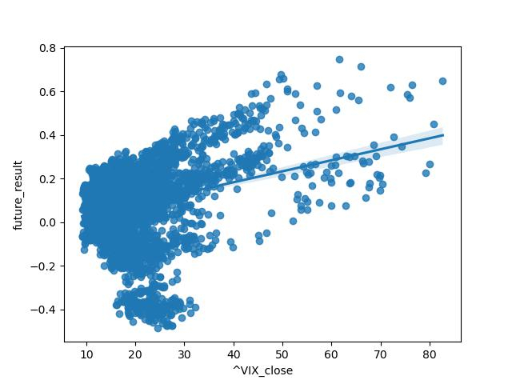

# STOCK MARKET PREDICTOR: Using the Vix to Predict S&P 500 Future Returns
This website is hosted at [stock-forecaster.herokuapp.com](https://stock-forecaster.herokuapp.com/).

## Summary

The Vix is the popular name for the Chicago Board Options Exchange's Volatility Index, a measure of the stock market's expected volatility based on S&P 500 index options. It is often referred to as the fear index or fear gauge. The Vix signals the level of fear or stress in the stock market. The higher the VIX, the greater the level of fear and uncertainty in the market, with levels above 30 indicating high levels of uncertainty.

The S&P 500 is the Standard and Poor's 500 index - a stock market index tracking the stock performance of 500 of the largest companies listed on stock exchanges in the United States. It is one of the most commonly followed equity indices, and is the index frequently referred to as "the market".

Machine learning models here demonstrate how elevated levels of the Vix can help predict a positive gain for the S&P 500 index one year into the future. When the Vix rises above 35, and especially above 50, this chart illustrates the historical return on the S&P 500 over the following year.

The process and results are also presented at [stock-forecaster.herokuapp.com](https://stock-forecaster.herokuapp.com/).

The performance of the S&P 500 is charted here from 2000-2023.

For each day, the one-year future return of the S&P 500 is plotted, with the percentage return on left (y-axis). The bottom (x-axis) shows the corresponding Vix value one-year prior. When the Vix is above 35, the S&P 500 has yielded positive returns 92.5% of the time over the following year. When the Vix exceeds 50, 98.6% of the returns were positive.

## Modules

3 machine learning modules were built and run in succession:
* 'Model1_Stock_multi_loop_Neural_Net_Mach_Learn.ipynb'
* 'Model2_Stock_single_pair_multi_test_Neural_Net_Mach_Learn.ipynb'
* 'Model3_Stock_VIX_SP500.ipynb'

'model.pkl' was exported from Model3_Stock_VIX_SP500.ipynb and embedded at [stock-forecaster.herokuapp.com](https://stock-forecaster.herokuapp.com/).

Flask application 'app.py' contains 3 routes:
* / (home) renders index.html, for the initial load
* predict also renders index.html, but modified for returning user entered modelling results
* models renders models.html, for a more detailed description of processes

templates/index.html for the main web page
templates/models.html for additional information on the machine learning models
static/css/styles.css for style formating
static/images for displayed images

data folder for two .xlsx files exported from 'Model1_Stock_multi_loop_Neural_Net_Mach_Learn.ipynb'

'Procfile', 'requirements.txt', and the stock-forecaster folder for Heroku deployment

## Data

Real-time API data on the website is collected from the [yfinance API](https://algotrading101.com/learn/yfinance-guide/). API data that used in building the machine learning models obtained from the the [yahoo-fin API](https://theautomatic.net/yahoo_fin-documentation/). All API data is originally sourced from [yahoo! Finance](https://finance.yahoo.com/).

Three models were used, with the first model automating a three-input loop which cycled through every unique pair of 21 securities, and then grouped each pair with the future results of two other securities (the S&P 500 and oil futures). Each run therefore consisted of 420 groupings, after which the other parameters (features used as model inputs, number of days used to determine the future return, etc.) were adjusted, and then the process was repeated.

21 ticker symbols were evaluated as inputs:  
* S&P 500 (^GSPC)  
* Dow Jones Industrial Average (^DJI)  
* NASDAQ Composite (^IXIC)  
* Russell 2000 (^RUT)  
* S&P Consumer Staples Sector (XLP)  
* S&P Energy Sector (XLE)  
* S&P Financial Sector (XLF)  
* S&P Health Care Sector (XLV)  
* S&P Industrial Sector (XLI)  
* S&P Materials Sector (XLB)  
* S&P Real Estate Sector (XLRE)  
* S&P Technology Sector (XLK)  
* S&P Utilities Sector (XLU)  
* S&P Communication Services (XLC)  
* S&P Consumer Discretionary (XLY)  
* CBOE Volatility Index (^VIX)  
* CBOE 3-Month Volatility (^VIX3M)  
* Crude Oil Futures (CL=F)  
* Treasury Yield 10 Years (^TNX)  
* Bitcoin USD (BTC-USD)  
* CMC Crypto 200 Index (^CMC200)

The results were measured for two securities:  
* SPY (an ETF that mirrors the S&P 500)  
* USO (an ETN made up of oil futures)

## Process

### Model 1:  
### Looping a Neural Network Model

The first model was a neural network run in Google Colaboratory. A list of 21 market ticker symbols were read into the code, and a loop determined each unique pair. For each pair, there were two different securities that were tested against for successful results. This created groups of three ticker symbols, and a total of 420 unique combinations to test with each model run.

Each combination of three securities was then processed and tested via an automated inner loop wrapped in an outer loop. 'yahoo! Finance' data for each was retrieved and loaded into pandas dataframes via the yahoo-fin API. The data was cleaned and merged into a single dataframe. The data was then scaled with StandardScaler, trained, compiled, and fit into a ReLU neural network model with 2 hidden layers, 5 nodes, and 5 epochs.

Results were reported for each of the 420 combinations. After completion, the input features and other variables (such as the length of time the results were testing) were adjusted, and the process was run to loop through and test the 420 combinations again with the adjustments. This entire process was repeated numerous times, and results were recorded. Any accuracy results over 70% for these first rounds of testing were noted.

At this point, it became clear that combinations containing the 'VIX' and 'VIX3M' closing values were generally returning the highest results. The outcomes were testing for a Boolean 'yes/no' positive result. They were highest when joined with the S&P 500 results, and a timeframe of one year was especially promising. Therefore, testing the S&P 500 results with the VIX and VIX3M closing values became the inputs for the next step, Model 2.

### Model 2:
### Optimizing the Neural Network Model

The results from the first model narrowed down the search, and so they were fed into a second model to optimize the testing, while plots were used to verify the data distribution.

Now that the 'VIX' and 'VIX3M' closing values were identified as inputs, they could be fed into another neural network model in Google Colaboratory that auto-optimized the variables. 'yahoo! Finance' data was again retrieved via the yahoo-fin API, and then was cleaned and merged into a pandas dataframe.

With the S&P 500's one-year return as the tested result as a Boolean 'yes/no' value, the two Vix symbols were scaled with MinMaxScaler instead (because all values were above zero). KerasTuner was used to auto-optimize the data. The activation was with ReLU (because of positive values), between 1-10 hidden layers, 5-200 nodes, and 5-20 epochs.

The optimal results determined by the KerasTuner optimizer were fed into the neural network with 8 hidden layers, nodes ranging from 35-200, and 20 epochs. An accuracy of 77.4% was returned.

A pandas plot chart and a seaborn plot with linear regression showed a very clear and pronounced upward-sloping trajectory of data points. This meant that higher VIX and VIX3M values translated into higher returns of the S&P 500 one year in the future. The plot charts also made it clear that there were very few negative results as the Vix values increased. The 'VIX' symbol specifically looked stronger than 'VIX3M' on the charts.

Symbol 'VIX' was now identified as the best choice for the final step, Model 3.

### Model 3:
### Linear and Non-linear Regressions

With the second model confirming the Vix closing price as an input, it was then charted against the specific future results of the S&P 500 one year from that point in Jupyter Noebook.

A Seaborn plot chart was created, along with a Matplotlib chart. Linear and non-linear regression lines were added, as well as a dividing line at zero percent with green/red plot formatting to more clearly identify positive/negative results.

SQL was run against the data to isolate the upper Vix values. The SQL results showed that beyond a Vix closing value of 35, 283 of 309 of the one-year returns (92.5%) were positive. Above a Vix value of 50, a positive return occurred 73 of 74 times (98.6%).

Queries also show that the average one-year return with the Vix over 35 is 28.2%, and the average over 50 is 32.4%. This is in contrast to the overall average annual return for the S&P 500 over the same period at 7% (without dividends).

When building the final machine model, linear and non-linear regression models were both considered. Ultimately the linear regression model was chosen because it is the more conservative of the two on this chart. The model is available be run with user-entered values at [stock-forecaster.herokuapp.com](https://stock-forecaster.herokuapp.com/).

## Technologies
* Python
* Flask
* GitHub
* Pandas
* Matplotlib
* Seaborn
* SQL
* Numpy
* Scipy
* Google Colaboratory
* Jupyter Notebook
* APIs (internal and external)
* Scikit-learn
* Scikit-learn: LinearRegression
* Scikit-learn: StandardScaler
* Scikit-learn: MinMaxScaler
* Scikit-learn: train_test_split
* Scikit-learn: accuracy_score
* KerasTuner
* TensorFlow
* Machine Learning
* Neural Networks
* HTML
* CSS
* Pickle
* Tableau
* Heroku

## Conclusion

First, we've heard it a million times, but it is still worth saying: Past performance may not be indicative of future results. There can be no assurance that the future performance of any specific investment, investment strategy, or product made reference to directly or indirectly on this website will be profitable, equal any corresponding indicated historical performance levels, or be suitable for your portfolio.

That said, the historical average of the Vix is just north of 20. However, values of the Vix going back to January, 2000 show long periods of relative calm interrupted by spikes in volatility. Historically, the model indicates that significant spikes are signals that the S&P 500 will likely be higher one-year from that point.

The testing results indicate a strong correlation between elevated Vix levels and positive one-year future returns from the S&P 500. For potential investors, a time to consider investing for a one-year period in the S&P 500 could be when the Vix is above 35, with results of a positive return frequency of 92.5%. A Vix over 50 has a smaller sample size but a higher positive frequency of 98.6%.